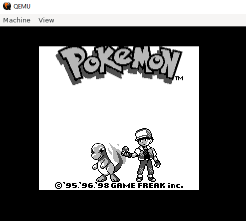

PokéBooter
==========

This is a joke "operating system" that only runs Pokémon Red. It's actually a simple protected mode x86 bootloader that bootstraps into a gameboy emulator that runs Pokémon Red. This serves no purpose.

Building & Running
------------------
Not sure why you'd want to run this but...

* You'll first need to place a ROM of Pokémon Red (Blue would probably work too) in the project named `pokemon.gb`
* Next build the emulator code by running `make` in the `chester_gb` folder
* Then build the boot image by running `make` in the root folder (this will incoporate the emulator)
* To run this in qemu execute `run.sh`

Notes
-----
* Since this uses a general purpose gameboy emulator it could run just about any game though you would have to modify the bootloader to load the right number of sectors and the emulator startup code (since I hardcoded the ROM size there)
* This is only tested in qemu and probably won't work on actual hardware (especially since modern hardware uses UEFI)
* I did this to teach myself some low level programming stuff so probably don't use this as a reference for writing a "good" bootloader. I'm sure the people at forum.osdev.org would be unhappy with this code.

License
-------
This project is licensed under GNU GPL v3. The project includes modified source code from [chester](https://github.com/veikkos/chester).